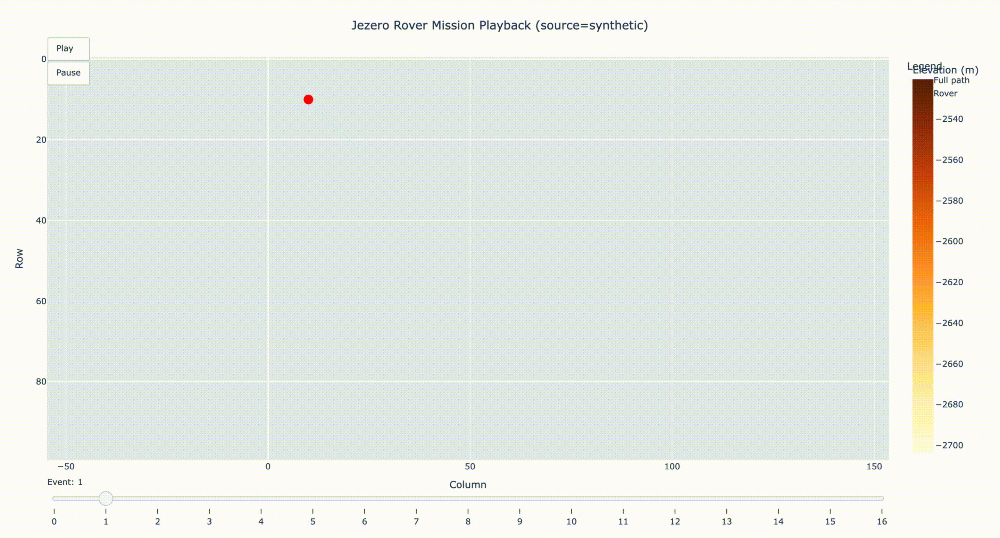

# MarsOps

**An autonomous Mars rover mission planner driven by Claude Code sub-agents and a custom MCP server.**

[](https://github.com/nour29110/marsops/actions/workflows/ci.yml)
[](https://www.python.org/downloads/)
[](https://github.com/astral-sh/uv)
[](https://github.com/astral-sh/ruff)
[](http://mypy-lang.org/)
[](https://docs.pytest.org/)
[](https://coverage.readthedocs.io/)
[](https://modelcontextprotocol.io/)
[](LICENSE)

---

You type this into Claude Desktop:

> *"Load the synthetic Jezero terrain, plan a mission starting at row 10 column 10 with 2 waypoints in the northwest quadrant, inject a dust storm at step 3, then execute the mission and tell me what happened."*

Claude Desktop calls six tools on a local MCP server you are running, loads a Digital Elevation Model of the real Jezero Crater that Perseverance is driving across right now, plans a validated energy-feasible mission, fires a dust storm mid-traverse, watches the rover handle it, and narrates the whole thing back to you like a flight director.




---

## Why this exists

I wanted a portfolio project that would force me to actually use the modern agentic AI tooling that top teams like SpaceX, JPL, and Anthropic are adopting, not just call a chat API. So I built a Mars rover mission planner from scratch in Python, and then wired it up to Claude Code sub-agents and a custom MCP server the way those teams would.

The result is a working closed-loop autonomous operations pipeline: terrain in, natural language goal in, validated plan out, simulated execution with mid-mission recovery, markdown sol report out. Everything runs locally, no paid APIs beyond the Claude Pro subscription used to develop it.

## Architecture at a glance

See [`docs/architecture.md`](docs/architecture.md) for the full Mermaid diagram and module-by-module walk through.

```
Claude Desktop
    │  (stdio MCP)
    ▼
MarsOps MCP Server  ──  6 tools, in-memory session
    │
    ├──  Planning layer
    │     ├── mission-planner (Opus sub-agent)
    │     │     └── iterative plan, dry-run, refine loop
    │     ├── A* pathfinder with slope-weighted cost
    │     └── recovery runtime (anomaly-handler, Opus)
    │
    ├──  Simulation layer
    │     ├── Rover (battery, clock, heading, state)
    │     ├── Execution engine with anomaly injection
    │     └── Closed-loop recovery on anomaly
    │
    └──  Data layer
          ├── Terrain loader (synthetic or real USGS CTX DTM)
          ├── Telemetry event log
          └── Markdown mission reporter
```

## The seven sub-agents

MarsOps is coordinated by seven specialized Claude Code sub-agents, each with a bounded scope defined in `.claude/agents/`. Only the two strategic agents run on Opus, everything else is Sonnet for token efficiency.

| Agent | Model | Role |
|---|---|---|
| `code-reviewer` | Sonnet | Reviews diffs before commit, never writes code |
| `test-writer` | Sonnet | Writes pytest and hypothesis tests, never touches source |
| `path-finder` | Sonnet | Owns A* and cost function code |
| `viz-builder` | Sonnet | Owns plotting and mission playback code |
| `telemetry-analyst` | Sonnet | Owns the markdown report generator |
| `mission-planner` | **Opus** | Iteratively plans, dry-runs, and refines mission plans |
| `anomaly-handler` | **Opus** | Decides recovery strategy when anomalies fire mid-mission |

## The agentic loop

The core of MarsOps is an iterative plan-simulate-refine loop. `mission-planner` proposes candidate waypoints, calls the dry-run validator which simulates the rover walking the full plan, reads the predicted battery and duration, and if the plan is infeasible, drops the farthest waypoint and tries again up to five times. Every feasibility claim in the final plan is backed by an actual simulation run. Receipt from the log:

```
Refinement iteration 1: feasible=False, reason=battery exhausted
Dropped waypoint (12, 37) (farthest from start)
Refinement iteration 2: feasible=False, reason=battery exhausted
Dropped waypoint (12, 25) (farthest from start)
Refinement iteration 3: feasible=True, reason=battery=67.6% (min=15.0%)
```

When an anomaly fires mid-mission, the same loop runs in reverse via `anomaly-handler`, producing a new plan from the rover's current state that is itself validated before the engine resumes. This is the same ground-in-the-loop pattern JPL uses for Perseverance operations, scaled down to a laptop.

## Terrain data

MarsOps supports two terrain sources through the same `Terrain` API:

- **Synthetic**, a deterministic seeded Jezero-like DEM generated from layered sinusoids plus a shallow Gaussian crater and a northwest delta ramp. Fast, reproducible, used by default.
- **Real**, a 9 MB USGS CTX Digital Terrain Model of Jezero Crater pulled from the NASA PDS mirror on first run and cached. This is the same data product Mars 2020 mission planners reference.

Switch at the CLI with `--source real` or from Claude Desktop by asking for it.

## Quickstart

```bash
git clone https://github.com/nour29110/marsops.git
cd marsops
uv sync
uv run pytest
```

Run the three built-in demos:

```bash
# 1. Basic A* on Jezero, writes output/jezero_path.html
uv run python scripts/demo_path.py

# 2. Full mission with rover sim, battery, telemetry, playback
uv run python scripts/demo_mission.py

# 3. Full mission with anomalies and closed-loop recovery
uv run python scripts/demo_anomaly.py
```

Each demo writes an interactive HTML file to `output/` that you can open in a browser.

## Driving the rover from Claude Desktop

See [`docs/mcp_setup.md`](docs/mcp_setup.md) for the full setup. In short: start the MCP server, add one snippet to `claude_desktop_config.json`, quit and reopen Claude Desktop, and the six MarsOps tools appear in the tool drawer. Then chat with the rover in plain English.

## Built with

- **Language**, Python 3.11
- **Packaging**, [uv](https://github.com/astral-sh/uv)
- **Linting and formatting**, [ruff](https://github.com/astral-sh/ruff)
- **Type checking**, [mypy](http://mypy-lang.org/) in strict mode
- **Testing**, [pytest](https://docs.pytest.org/) with [hypothesis](https://hypothesis.readthedocs.io/) property-based tests
- **Pre-commit**, [pre-commit](https://pre-commit.com/) running ruff and mypy
- **CI**, GitHub Actions
- **Agentic tooling**, [Claude Code](https://github.com/anthropics/claude-code) with seven custom sub-agents, hooks, and a project-level `CLAUDE.md`
- **Natural language interface**, a custom [MCP](https://modelcontextprotocol.io/) server built with the official Python SDK
- **Geospatial**, numpy, scipy, rasterio, networkx
- **Visualization**, plotly for interactive HTML, matplotlib for static plots
- **API layer (planned)**, FastAPI with HTMX dashboard

## Project status

Version 0.1.0. Feature-complete through closed-loop recovery and the Claude Desktop MCP integration. See [`docs/interview_talking_points.md`](docs/interview_talking_points.md) for a detailed walk through, and [`docs/anomaly_recovery_trace.txt`](docs/anomaly_recovery_trace.txt) for a real captured run.

## License

MIT, see [`LICENSE`](LICENSE).