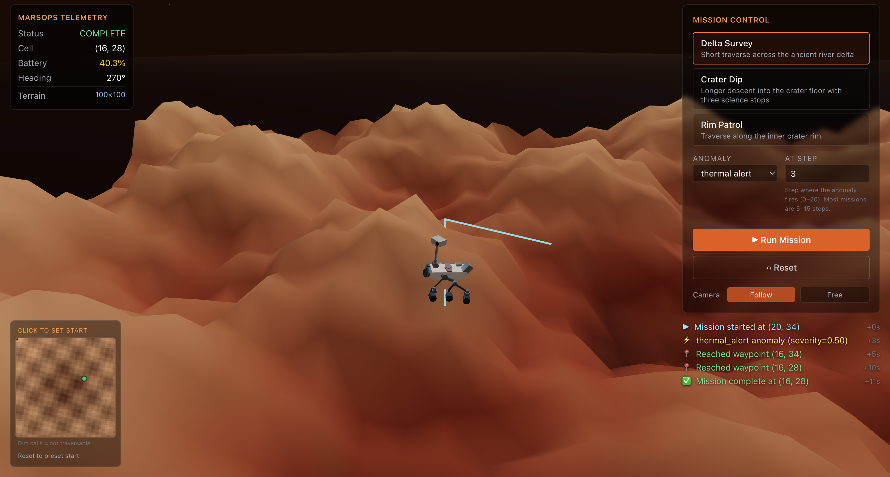
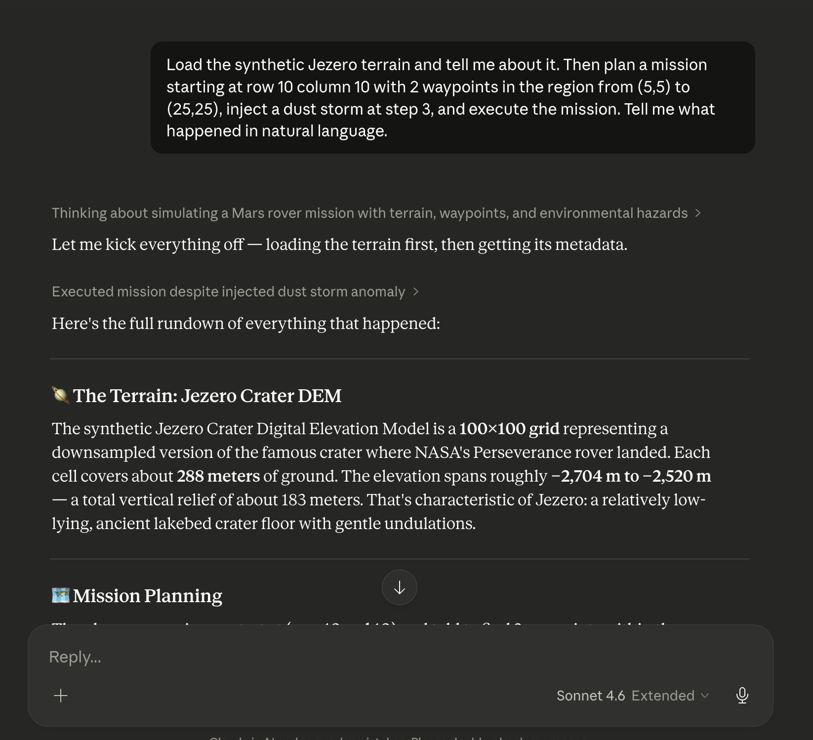

# MarsOps

**An autonomous Mars rover mission planner you can drive in your browser, in natural language, or from Claude Desktop.**

[](https://github.com/nour29110/marsops/actions/workflows/ci.yml)
[](https://www.python.org/downloads/)
[](https://github.com/astral-sh/uv)
[](https://github.com/astral-sh/ruff)
[](http://mypy-lang.org/)
[](https://docs.pytest.org/)
[](https://coverage.readthedocs.io/)
[](https://modelcontextprotocol.io/)
[](LICENSE)

---

### 🚀 Try it live

**[marsops.vercel.app](https://marsops.vercel.app)**

> The backend runs on a free tier that sleeps after 15 minutes of inactivity. The first mission you run may take 20 to 30 seconds to start while the server wakes up. Every subsequent run is instant.

Open the site, click **Run Mission**, and watch a Curiosity-class rover plan a route across real Jezero Crater terrain, execute it in a live 3D scene, and survive a dust storm or a stuck wheel along the way. No install, no signup.





---

## What this is

MarsOps is a portfolio project that explores what agentic AI engineering actually looks like in practice, using a Mars rover mission planner as the vehicle. The system loads real Jezero Crater elevation data from the USGS PDS mirror, plans rover traverses with A* over slope-weighted terrain, simulates execution on a Perseverance-inspired energy model, and recovers from mid-mission anomalies through a closed-loop replan.

The entire stack is coordinated by seven Claude Code sub-agents with bounded scopes, two of them running on Opus for strategic reasoning, and the whole thing is exposed to both Claude Desktop (via a custom Model Context Protocol server) and a live 3D web UI (via a FastAPI backend with streaming telemetry over WebSocket). You can drive the rover by typing in natural language to Claude Desktop, by clicking buttons in the browser, or by curling the REST API directly.

## How you can drive the rover

There are three fully working entry points, in order of effort to try:

1. **The web app at [marsops.vercel.app](https://marsops.vercel.app).** Pick a preset, optionally inject an anomaly, click Run Mission. Watch it animate in 3D with React Three Fiber.
2. **Claude Desktop with the MCP server.** Follow [`docs/mcp_setup.md`](docs/mcp_setup.md), then say things like *"plan a mission from (10, 10) with two waypoints in the northwest quadrant and inject a dust storm at step three"*. Claude will call six tools on your local MCP server and narrate the results.
3. **The REST API directly.** Every tool the MCP server exposes is also a POST to `/api/command` on the FastAPI backend. Good for scripting and for understanding the wire protocol.

---

## Architecture

See [`docs/architecture.md`](docs/architecture.md) for the full Mermaid diagram and module-by-module walk through.

## The seven sub-agents

MarsOps is coordinated by seven specialized Claude Code sub-agents, each with a bounded scope defined in `.claude/agents/`. Only the two strategic agents run on Opus, everything else is Sonnet for token efficiency.

| Agent | Model | Role |
|---|---|---|
| `code-reviewer` | Sonnet | Reviews diffs before commit, never writes code |
| `test-writer` | Sonnet | Writes pytest and hypothesis tests, never touches source |
| `path-finder` | Sonnet | Owns A* and cost function code |
| `viz-builder` | Sonnet | Owns plotting and mission playback code |
| `telemetry-analyst` | Sonnet | Owns the markdown report generator |
| `mission-planner` | **Opus** | Iteratively plans, dry-runs, and refines mission plans |
| `anomaly-handler` | **Opus** | Decides recovery strategy when anomalies fire mid-mission |

## The agentic loop

The core of MarsOps is an iterative plan-simulate-refine loop. The `mission-planner` sub-agent proposes candidate waypoints, calls the dry-run validator which simulates the rover walking the full plan, reads the predicted battery and duration, and if the plan is infeasible, drops the farthest waypoint and tries again up to five times. Every feasibility claim in the final plan is backed by an actual simulation run. Receipt from the log:
Refinement iteration 1: feasible=False, reason=battery exhausted
Dropped waypoint (12, 37) (farthest from start)
Refinement iteration 2: feasible=False, reason=battery exhausted
Dropped waypoint (12, 25) (farthest from start)
Refinement iteration 3: feasible=True, reason=battery=67.6% (min=15.0%)

When an anomaly fires mid-mission, the same loop runs in reverse via `anomaly-handler`, producing a new plan from the rover's current state that is itself validated before the engine resumes. This is the same ground-in-the-loop pattern JPL uses for Perseverance operations, scaled down to a laptop.

## Terrain data

MarsOps supports two terrain sources through the same `Terrain` API:

- **Synthetic**, a deterministic seeded Jezero-like DEM generated from layered sinusoids plus a shallow Gaussian crater and a northwest delta ramp. Fast, reproducible, used by default.
- **Real**, a 9 MB USGS CTX Digital Terrain Model of Jezero Crater pulled from the NASA PDS mirror on first run and cached. This is the same data product Mars 2020 mission planners reference.

Switch at the CLI with `--source real`, or from Claude Desktop by asking for it.

## Quickstart (local)

**Backend:**

```bash
git clone https://github.com/nour29110/marsops.git
cd marsops
uv sync
uv run pytest          # 620 passing, 93% coverage
uv run marsops-web     # FastAPI on http://localhost:8000
```

**Frontend (separate terminal):**

```bash
cd web
npm install
npm run dev            # Vite on http://localhost:5173
```

Open `http://localhost:5173` and click Run Mission.

**Standalone demos (no web UI needed):**

```bash
uv run python scripts/demo_path.py       # A* path on Jezero
uv run python scripts/demo_mission.py    # Full rover sim + telemetry
uv run python scripts/demo_anomaly.py    # Mid-mission anomaly + recovery
```

Each demo writes an interactive HTML file to `output/` that you can open in a browser.

## Driving the rover from Claude Desktop

See [`docs/mcp_setup.md`](docs/mcp_setup.md) for the full setup. In short, start the MCP server, add one snippet to `claude_desktop_config.json`, quit and reopen Claude Desktop, and the six MarsOps tools appear in the tool drawer. Then chat with the rover in plain English.

## Deployment

The live demo is deployed in two pieces:

- **Backend on [Render](https://render.com)**, free tier, as a Docker container built from the `Dockerfile` at the repo root. Configured in [`render.yaml`](render.yaml). Sleeps after 15 minutes of inactivity, which is why the first request after a cold period takes ~30 seconds.
- **Frontend on [Vercel](https://vercel.com)**, free tier, built from the `web/` folder with Vite. Points at the Render backend via `VITE_API_URL`.

Both platforms auto-redeploy on every push to `main` via GitHub integration.

## Built with

- **Language**, Python 3.11 (backend), TypeScript 5 (frontend)
- **Packaging**, [uv](https://github.com/astral-sh/uv) for Python, npm for Node
- **Linting and formatting**, [ruff](https://github.com/astral-sh/ruff)
- **Type checking**, [mypy](http://mypy-lang.org/) in strict mode
- **Testing**, [pytest](https://docs.pytest.org/) with [hypothesis](https://hypothesis.readthedocs.io/) property-based tests
- **Pre-commit**, [pre-commit](https://pre-commit.com/) running ruff and mypy
- **CI**, GitHub Actions
- **Agentic tooling**, [Claude Code](https://github.com/anthropics/claude-code) with seven custom sub-agents, hooks, and a project-level `CLAUDE.md`
- **Natural language interface**, a custom [MCP](https://modelcontextprotocol.io/) server built with the official Python SDK
- **Web API**, [FastAPI](https://fastapi.tiangolo.com/) with a WebSocket telemetry stream
- **Web frontend**, [React](https://react.dev/) 18, [Vite](https://vitejs.dev/), [React Three Fiber](https://r3f.docs.pmnd.rs/), [drei](https://github.com/pmndrs/drei), [zustand](https://github.com/pmndrs/zustand), [Tailwind](https://tailwindcss.com/) v3
- **Geospatial**, numpy, scipy, rasterio, networkx
- **Visualization**, plotly for interactive HTML, matplotlib for static plots
- **Deployment**, Docker, Render (backend), Vercel (frontend)

## Project status

Version 0.2.0. Feature-complete through closed-loop recovery, the Claude Desktop MCP integration, and a deployed 3D web UI with live telemetry streaming. See [`docs/anomaly_recovery_trace.txt`](docs/anomaly_recovery_trace.txt) for a real captured run.

## License

MIT, see [`LICENSE`](LICENSE).
