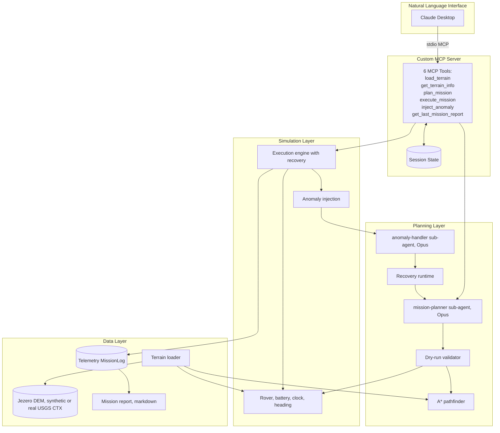

# MarsOps Architecture

MarsOps is an autonomous Mars rover mission planner built on top of Claude Code sub-agents and a custom MCP server. The system is organized as a pipeline of independent modules, each tested in isolation, coordinated by two Opus-powered sub-agents for high-level reasoning and a custom MCP server that exposes the whole stack to natural-language clients like Claude Desktop.

## System diagram

## Module responsibilities

The `terrain` module loads and validates elevation data from two sources: a deterministic synthetic Jezero-like DEM (used by default, fast, seeded) and a real 9 MB USGS CTX Digital Terrain Model of Jezero Crater pulled from the NASA PDS mirror on first use. Both sources produce the same `Terrain` object, exposing elevation, slope, traversability, and a down-sampling helper.

The `planner` module contains A* pathfinding on the 8-connected terrain grid with an octile heuristic and a pluggable cost function that penalizes slope quadratically. On top of A*, a dry-run validator simulates a proposed plan without emitting telemetry events, which lets the planning layer cheaply test feasibility many times before committing. The deterministic `plan_mission` runtime implements a heuristic loop that proposes candidate waypoints from a region of interest, orders them nearest-neighbor, dry-runs, drops the farthest waypoint on failure, and retries up to five times.

The `simulator` module defines a `Rover` with realistic Perseverance-inspired defaults (2000 Wh battery, 0.042 m/s top speed, reduced-duty-cycle drive draw) and an execution engine that walks a path cell by cell, advancing the clock and draining the battery. A second engine function, `execute_path_with_recovery`, accepts a stream of anomalies and a recovery callback, fires anomalies at their configured steps, and hands control to the recovery layer when one invalidates the remaining plan.

The `telemetry` module defines typed pydantic event models (`mission_start`, `step`, `waypoint_reached`, `low_battery`, `anomaly`, `recovery_replan`, `mission_complete`, `mission_failed`) and a `MissionLog` container. A reporter generates clean markdown mission debriefs in the style of a JPL sol report, with metrics, timeline, anomalies, and recommendation sections.

The `mcp_server` module wraps the whole stack in a FastMCP server with six tools and an in-memory session. Running `marsops-mcp` starts a stdio server that Claude Desktop connects to directly, allowing a user to plan and execute missions in natural language.

## Claude Code sub-agents

MarsOps uses six specialized Claude Code sub-agents, each defined in `.claude/agents/`:

1. `code-reviewer`, Sonnet, reviews diffs before commit.
2. `test-writer`, Sonnet, writes pytest and hypothesis tests for new modules.
3. `path-finder`, Sonnet, owns A* and cost-function code.
4. `telemetry-analyst`, Sonnet, owns report generation.
5. `mission-planner`, **Opus**, decomposes natural-language mission goals into validated waypoint plans via an iterative dry-run loop.
6. `anomaly-handler`, **Opus**, decides recovery strategies when anomalies fire mid-mission.

Only the two strategic agents run on Opus. All other work, including the main conversation thread, runs on Sonnet for token efficiency.

## The agentic loop

The core innovation of MarsOps is not that an LLM talks about Mars missions, it is that the `mission-planner` sub-agent **iteratively plans, dry-runs, evaluates, and refines** before committing to a plan. Every feasibility claim in the final plan is backed by an actual simulation run. When the rover then encounters an anomaly mid-mission, the `anomaly-handler` closes the same loop in reverse: it inspects the rover's current state, the remaining goal, and newly-discovered hazards, then produces a new plan that is itself dry-run-validated before the engine resumes execution. This is the same pattern JPL's MAPGEN planner uses for Curiosity and Perseverance ground-in-the-loop operations, scaled down to a single laptop.
